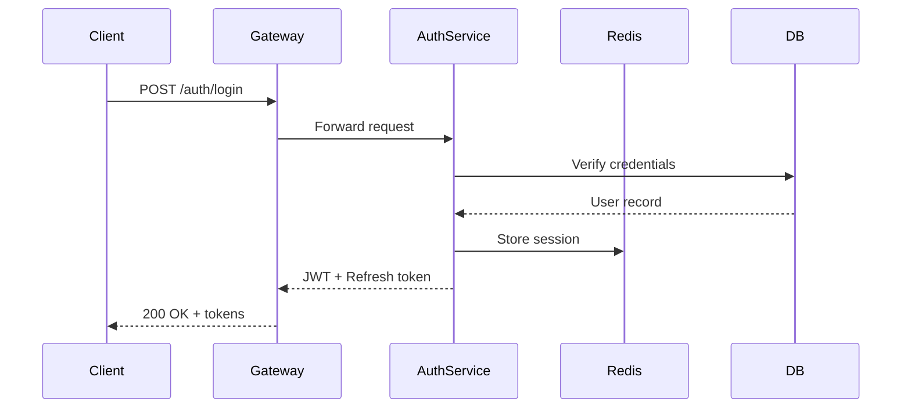

# Authentication Service Plan

## Overview

This document outlines the plan for building a new authentication service
that supports OAuth2, SAML, and magic link authentication.

> **Note**: This plan covers the MVP scope. SAML integration is deferred to Phase 2
> unless the enterprise sales team escalates priority.

## Architecture

The service will be built as a standalone microservice with its own
PostgreSQL database. It exposes a REST API consumed by the API gateway.

### Components

1. **Auth API** — handles login, logout, token refresh
2. **Token Service** — JWT issuance and validation
3. **Provider Adapters** — pluggable OAuth2/SAML providers
4. **Session Store** — Redis-backed session management

### Tech Stack Comparison

| Component   | Option A       | Option B      | Decision   |
| ----------- | -------------- | ------------- | ---------- |
| Language    | Elixir/Phoenix | Go            | Go         |
| Database    | PostgreSQL     | CockroachDB   | PostgreSQL |
| Cache       | Redis          | Memcached     | Redis      |
| Auth tokens | JWT            | Opaque tokens | JWT        |

## Database Schema

The core tables are:

- `users` — basic user identity
- `credentials` — password hashes, OAuth tokens
- `sessions` — active sessions with expiry
- `audit_log` — all auth events for compliance

```sql
CREATE TABLE users (
    id UUID PRIMARY KEY DEFAULT gen_random_uuid(),
    email VARCHAR(255) UNIQUE NOT NULL,
    email_verified_at TIMESTAMPTZ,
    created_at TIMESTAMPTZ DEFAULT now(),
    updated_at TIMESTAMPTZ DEFAULT now()
);

CREATE TABLE sessions (
    id UUID PRIMARY KEY DEFAULT gen_random_uuid(),
    user_id UUID REFERENCES users(id) ON DELETE CASCADE,
    token_hash VARCHAR(64) NOT NULL,
    expires_at TIMESTAMPTZ NOT NULL,
    ip_address INET,
    user_agent TEXT,
    created_at TIMESTAMPTZ DEFAULT now()
);
```

## API Endpoints

### POST /auth/login

Accepts email/password or provider token. Returns a JWT access token
and a refresh token. Rate limited to 5 attempts per minute per IP.

```json
{
  "email": "user@example.com",
  "password": "...",
  "provider": null
}
```

### POST /auth/refresh

Accepts a valid refresh token, returns a new access/refresh pair.
Refresh tokens are single-use and rotate on each call.

### DELETE /auth/session

Invalidates the current session. Supports optional `all=true` param
to invalidate all sessions for the user (global logout).

## MVP Checklist

- [x] Design database schema
- [x] Set up project scaffolding
- [ ] Implement login endpoint
- [ ] Implement token refresh
- [ ] Implement logout / session invalidation
- [ ] Add rate limiting
- [ ] Write integration tests
- [ ] Deploy to staging

## Auth Flow



## Architecture


## Deployment

Deployed as a Docker container on our existing k8s cluster.
Uses Vault for secret management and certificate rotation.

---

## Open Questions

- Should we support passwordless-only, or also allow password auth?
- What's the session TTL? 24h? 7d?
- Do we need to support SAML for the MVP, or can it wait?
